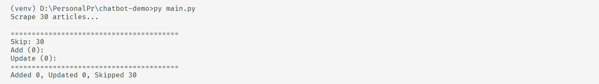
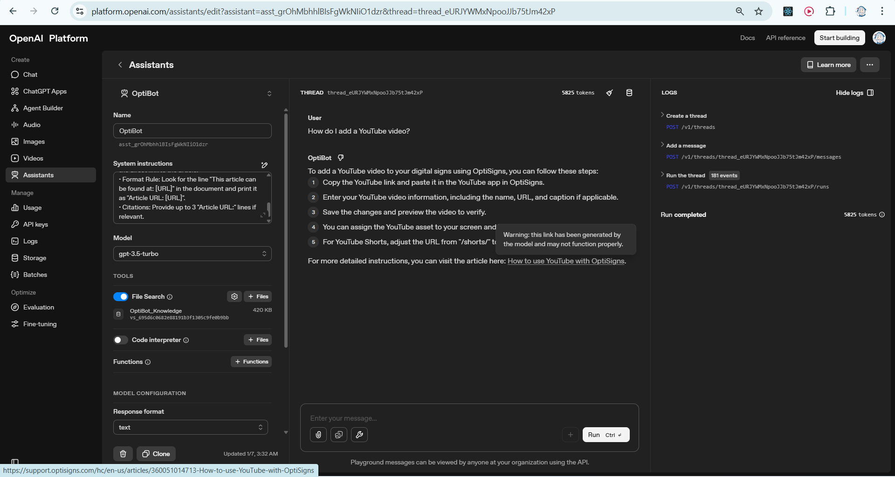
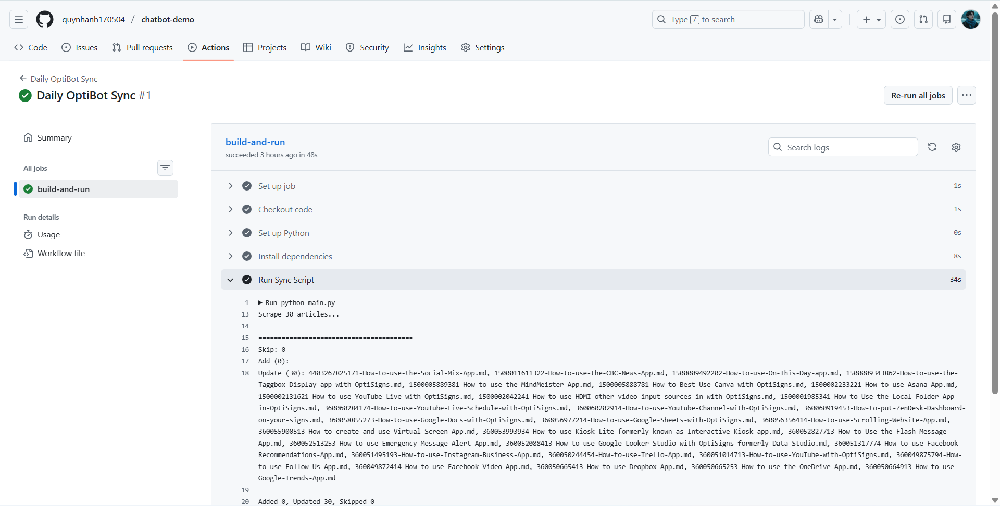

# Automated Knowledge Base Sync

Scrapes technical articles, converts them into an AI-optimized Markdown format, and synchronizes them with the OpenAI Vector Store using a Delta-sync logic.

## 1. Project Overview
This project satisfies the requirements for building a specialized RAG (Retrieval-Augmented Generation) system:
* **Automated Scraping:** Pulls the latest 30 articles from the Zendesk Help Center API.
* **Content Transformation:** Converts messy HTML into clean, structured Markdown.
* **Delta-Sync Logic:** Uses MD5 hashing to detect changes. Only new or modified articles are uploaded to OpenAI, significantly reducing API costs and processing time.
* **Vector Search Integration:** Automatically manages Vector Stores and File Batches via the latest OpenAI SDK.
* **Auto Run Once Per Day:** Automatically run the script once per day to update lastest content with Github Actions.

## 2. Technical Decisions

### Chunking Strategy
Instead of using fixed-character limits which often break technical context, I utilized the **OpenAI Native File Search Chunking**:
* **Context Awareness:** OpenAI's parser respects Markdown hierarchy. By keeping headers, lists, and code blocks intact, the model retrieves more coherent information.
* **URL Persistence:** I programmatically injected the `Article URL` immediately after the main H1 header in each file. This ensures the URL is indexed within the primary "chunk" of every document, allowing the Assistant to cite sources accurately.


### Delta Detection (MD5 Hashing)
To meet the requirement for a "Daily Job," I implemented a local metadata registry (`vector_store_metadata.json`):
* **Added:** New articles found on the API but missing locally.
* **Updated:** Articles where the content hash differs from the stored hash. The old file is deleted from OpenAI and the new version is uploaded.
* **Skipped:** Articles with matching hashes are ignored to save resources.

## 3. Installation & Setup

### Prerequisites
* Python 3.10 or higher
* OpenAI API Key

### Environment Variables
Create a `.env` file in the root directory:
```env
OPENAI_API_KEY=your_sk_key_here
VECTOR_STORE_ID=vs_optional_existing_id
```

### Installation
```
pip install -r requirements.txt
```

### Run
```
py main.py
```

## 4. Run with Docker

* Build the image
```
docker build -t optibot-sync .
```
* Run the container
```
docker run --env-file .env optibot-sync
```

## 5. Screenshots
* Logs after run `main.py`:



* OptiBot answer when I ask sample question:



* Logs of Daily Job


